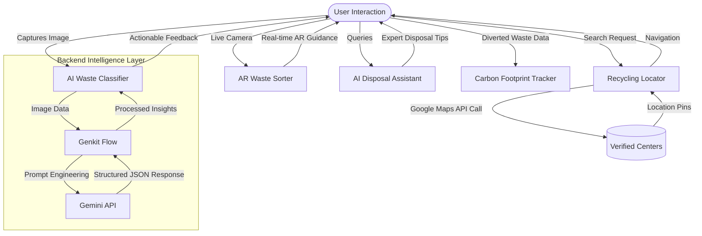

# 🌍 Eco-Way to Waste-Free World (EWWW)

<div align="center">
  

  ### 🌱 A sustainable digital solution to reduce waste, promote recycling, and guide users toward eco-friendly practices.

  [](https://github.com/TanayKapoor21/eco-way-to-waste-free-world/blob/main/LICENSE)
  [](https://nextjs.org/)
  [](https://tailwindcss.com/)
  [](https://ai.google.dev/)
</div>

---

## 📌 Project Overview

**EWWW (Eco Way to a Waste-Free World)** is an advanced, mobile-first web application designed to bridge the gap between individual intention and effective environmental action. By leveraging **Generative AI** and **Augmented Reality**, EWWW empowers users to classify waste, find recycling hubs, and track their personal environmental impact in real-time.

> [!IMPORTANT]
> This project was developed as part of the **Smart India Hackathon (SIH)** to tackle urban waste management challenges in India.

---

## ✨ Features Showcase

<details open>
<summary><b>🤖 AI-Powered Waste Classifier</b></summary>
<br>
Snap a photo of any waste item, and our AI model (Gemini 2.0 Flash) instantly identifies the material, providing precise disposal instructions and creative upcycling suggestions.
</details>

<details>
<summary><b>🕶️ AR Waste Sorter</b></summary>
<br>
Using a live camera feed, this feature provides real-time, on-screen guidance for sorting waste into correct bins (Wet, Dry, Recyclable, E-waste) using Augmented Reality overlays.
</details>

<details>
<summary><b>📍 Smart Recycling Locator</b></summary>
<br>
Integrated with Google Maps, this tool helps you find the nearest e-waste drop-offs, plastic collection centers, and community compost pits based on your current location.
</details>

<details>
<summary><b>📊 Carbon Footprint Tracker</b></summary>
<br>
Gamify your sustainability journey! Track the volume of waste you've diverted from landfills and see your personal contribution to CO₂ emission reduction.
</details>

<details>
<summary><b>💬 AI Disposal Assistant</b></summary>
<br>
A friendly, 24/7 chatbot powered by Genkit that answers your sustainability queries—from "How do I dispose of old batteries?" to "Guide me on starting a home compost."
</details>

---

## 🛠️ System Architecture

The following flowchart illustrates the seamless integration of our AI engine with the user interface:



---

## 🚀 Technology Stack

| Category | Tech | Description |
|----------|------|-------------|
| **Core** | [Next.js](https://nextjs.org/) | React-based framework for high performance and SEO. |
| **Logic** | [TypeScript](https://www.typescriptlang.org/) | Type-safe development for scalability. |
| **Styling** | [Tailwind CSS](https://tailwindcss.com/) | Utility-first styling with [Shadcn/UI](https://ui.shadcn.com/) components. |
| **AI/ML** | [Genkit](https://firebase.google.com/docs/genkit) + [Gemini](https://ai.google.dev/) | High-speed image classification and chatbot logic. |
| **Maps** | [Google Maps Platform](https://mapsplatform.google.com/) | Real-time geolocating of recycling infrastructure. |
| **Hosting** | [Firebase](https://firebase.google.com/) | Scalable serverless hosting via App Hosting. |

---

## ⚙️ Getting Started

### 📋 Prerequisites

- **Node.js** (v18.x or higher)
- **Firebase CLI**
- **Gemini API Key** (from Google AI Studio)
- **Google Maps API Key**

### 🛠️ Installation & Setup

1. **Clone the repository:**
   ```bash
   git clone https://github.com/TanayKapoor21/eco-way-to-waste-free-world.git
   cd eco-way-to-waste-free-world
   ```

2. **Install dependencies:**
   ```bash
   npm install
   ```

3. **Configure Environment Variables:**
   Create a `.env.local` file and add your credentials:
   ```env
   GOOGLE_GENAI_API_KEY=your_gemini_api_key
   NEXT_PUBLIC_GOOGLE_MAPS_API_KEY=your_maps_api_key
   ```

4. **Run the development server:**
   ```bash
   npm run dev
   ```
   Open `http://localhost:3000` to see the magic! 🚀

---

## 🌍 Impact & Future Vision

-   **Environmental:** Reducing landfill volume through improved household segregation.
-   **Social:** Empowering citizens with the knowledge to lead a zero-waste lifestyle.
-   **Future Scope:** 
    - 🏢 **Municipal Integration:** Connecting users to local waste collection schedules.
    - 🛒 **Circular Marketplace:** A platform to buy/sell upcycled products.
    - 🎓 **Educational Hub:** Gamified modules for schools and colleges.

---

## 🤝 Contribution

Contributions are what make the open-source community such an amazing place to learn, inspire, and create. Any contributions you make are **greatly appreciated**.

1. Fork the Project
2. Create your Feature Branch (`git checkout -b feature/AmazingFeature`)
3. Commit your Changes (`git commit -m 'Add some AmazingFeature'`)
4. Push to the Branch (`git push origin feature/AmazingFeature`)
5. Open a Pull Request

---

## ❤️ Show Your Support

Give a ⭐ if this project inspired you or helped you in any way!

**Developed with 💚 by Tanay Kapoor**  
*Sustainability | Tech | Data Analytics*

---

<p align="center">
  <i>Together, let’s build a waste-free world!</i>
</p>
